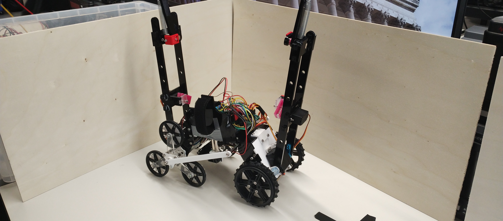

# Team 3 Obstacle Robot

This is the robot code for team 3 (Ezdubz) for the UCL Robotics and AI Term 3 challenge. 

## Guide to use

### Configuration

To start, most key parameters for robot behaviour are contained in the [globals.h](robot_program/globals.h) file, including `#define` statements which will enable or disable features such as debugging, the WiFi kill switch and runtime sensor calibration. 

When using the program, the first thing to do is to pick which of these you want enabled or disabled. 

Then, you will want to set up the obstacle order and count. The obstacles are defined in the `CurrentAction` enum, again in `globals.h`, and the sequence is stored in the constant array `obstacleSequence`.

> Certain obstacles are used as a technical feature for more complex sequencing, and should not be directly included in the array. These are `ACTION_LAVA_PIT_CROSS`, `ACTION_ZIPWIRE_EXTEND` and `ACTION_ZIPWIRE_DRIVE`. These are auto-triggered after their corresponding `APPROACH` actions.

If you are using line following, for more reliable performance, it is recommended to also specify a sequence, using the `NextLineEvent` enum. This sequence is stored in another constant array - `lineEventSequence`. While the robot can perform without this, complex sequences are a challenge, and there are certain edge-cases which can confuse the standard PID approach, especially with junctions. 

There are a number of other parameters in this file, from speeds to timings to sensor thresholds, all of which can also be changed to affect robot behaviour within each obstacle.

### Robot Setup

With the program configured, you can then compile and upload it to the Arduino Giga. When the program starts, the top arms will open up, and unless `NO_SPRING_ARMS` is defined, the first setup stage will begin.

1. The front spring arm should be manually retracted so that it sits within the pink rocker part. Then you can press the kill button at the back of the robot to close the lock on that arm, holding the arm in place. This should then be repeated for the back arm. (Note that the main arms will retract instantly after the second button press, so mind your hands). 

After this, regardless of whether the first stage was run or not, the next stage will begin. If `MANUAL_LINE_CALIBRATION` is not defined, simply press the button again and the line sensor servo will rapidly extend and retract. However, if it is defined, the following should be performed.

2. The sensor will extend and stay there for around 10 seconds. During this time, you should pass the robot back and forward across the line it will need to follow (while keeping the wheels on the floor) in order to threshold the sensor. 

The defaults provided work well for a black line on a white surface, but other cases should be calibrated in this manner. 

Once the sensor has retracted, you can place the robot.

### Starting the Robot

If starting with a line, the robot should be placed either on or directly behind the line it will be following - it defaults to a moderate crawl forward to start, allowing it to find the line if it does not immediately detect it. 

If starting with wall following, it is recommended to place the robot the correct distance away from the wall - although it will correct, it can induce oscillations, especially when simultaneously going over obstacles and making these large corrections. 

Once the robot is placed, the previously mentioned kill switch can be pressed, and the robot will start moving. Pressing this button again, or transmiiting a UDP packed containing the string `"STOP"` (unless `NO_WIFI` is defined) will immediately halt the robot and detach all servos to prevent any injuries. 